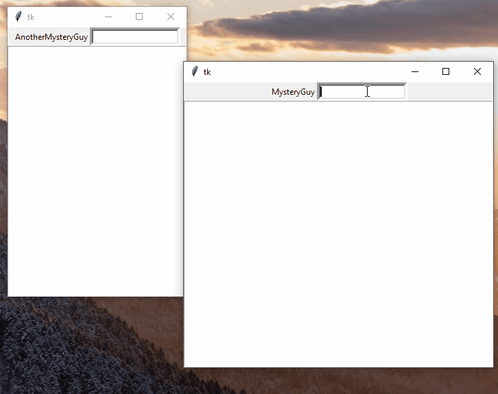
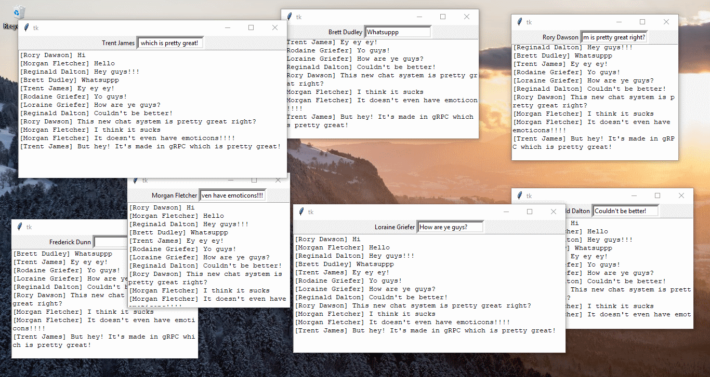

# Python gRPC Chat
Aplicativo de bate-papo criado com gRPC. Este foi um estudo para streaming gRPC bidirecional.

# Demo





## Server

```python
class ChatServer(rpc.ChatServerServicer):

    def __init__(self):
        # Lista com todo o histórico do chat
        self.chats = []

    # O fluxo que será usado para enviar novas mensagens aos clientes
    def ChatStream(self, request_iterator, context):
        """
        Esta é uma chamada do tipo de fluxo de resposta. Isso significa que o servidor pode continuar enviando mensagens
        Todo cliente abre essa conexão e espera o servidor enviar novas mensagens

        :param request_iterator:
        :param context:
        :return:
        """
        lastindex = 0
        # Para cada cliente, um loop infinito é iniciado (no próprio thread gerenciado do gRPC)
        while True:
            # Verifique se há novas mensagens
            while len(self.chats) > lastindex:
                n = self.chats[lastindex]
                lastindex += 1
                yield n

    def SendNote(self, request: chat.Note, context):
        """
        Este método é chamado quando um cliente envia uma Nota para o servidor.

        :param request:
        :param context:
        :return:
        """
        print("[{}] {}".format(request.name, request.message))
        # Adicione-o ao histórico de bate-papo
        self.chats.append(request)
        return chat.Empty()
```

## Client

```python
address = 'localhost'
port = 11912


class Client:

    def __init__(self, u: str, window):
        # o quadro para colocar os componentes da interface do usuário
        self.window = window
        self.username = u
        # criar um canal gRPC + stub
        channel = grpc.insecure_channel(address + ':' + str(port))
        self.conn = rpc.ChatServerStub(channel)
        # crie um novo thread de escuta para quando novos fluxos de mensagens chegarem
        threading.Thread(target=self.__listen_for_messages, daemon=True).start()
        self.__setup_ui()
        self.window.mainloop()

    def __listen_for_messages(self):
        """
        Este método será executado em um encadeamento separado como o encadeamento principal/ui, porque a chamada for-in está bloqueando
        ao aguardar novas mensagens
        """
        for note in self.conn.ChatStream(chat.Empty()):
            print("R[{}] {}".format(note.name, note.message))
            self.chat_list.insert(END, "[{}] {}\n".format(note.name, note.message))

    def send_message(self, event):
        """
        Este método é chamado quando o usuário digita algo na caixa de texto
        """
        message = self.entry_message.get()
        if message is not '':
            n = chat.Note()
            n.name = self.username
            n.message = message
            print("S[{}] {}".format(n.name, n.message))
            self.conn.SendNote(n)
            
    ...
```

## The proto file

```proto
syntax = "proto3";

package grpc;

message Empty {}

// Eu chamei de Nota porque a mensagem Mensagem é chata de se trabalhar
message Note {
    string name = 1;
    string message = 2;
}

service ChatServer {
    // Este fluxo bidirecional permite enviar e receber Notas entre 2 pessoas
    rpc ChatStream (Empty) returns (stream Note);
    rpc SendNote (Note) returns (Empty);
}
```
